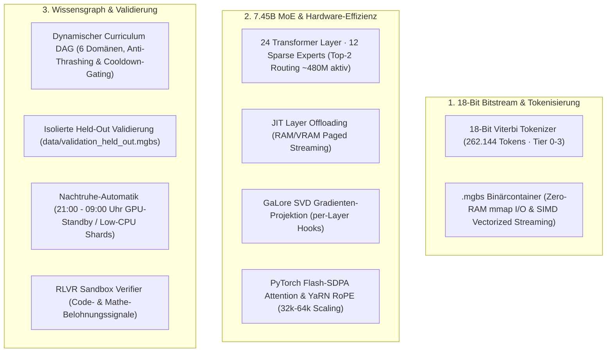

# Multi-Granular Bitstream LLM (MGBS) 🔬

[](https://opensource.org/licenses/MIT)
[](https://python.org)
[](https://pytorch.org)
[](file:///home/benjamin/Bilder/tests)

Eine **empirisch evaluierte, ressourceneffiziente Language-Model-Architektur** für 7.45B Sparse Mixture-of-Experts (MoE) auf Consumer-Hardware. Das System kombiniert einen **hierarchischen 18-Bit Viterbi-Bitstream (262.144 Tokens)**, **JIT Layer Offloading**, **GaLore Low-Rank Gradienten-Projektion** und einen **dynamischen Wissensgraphen (Curriculum DAG)** mit automatischer Nachtruhe-Steuerung.

---

## 🔬 Empirischer Benchmark: 18-Bit Viterbi Bitstream vs. Standard BPE

Reale Messung ([`scripts/benchmark_bitstream_vs_bpe.py`](file:///home/benjamin/Bilder/scripts/benchmark_bitstream_vs_bpe.py)) auf identischen Testdaten im direkten Vergleich mit **OpenAI `cl100k_base` (GPT-4)** und **GPT-2 BPE**:

| Test-Domäne | Raw Bytes | MGBS (18-Bit Viterbi 262k) | BPE (cl100k / GPT-4) | BPE (GPT-2 50k) | Differenz vs. GPT-4 BPE | Eff. 7.168 Kontextfenster |
| :--- | :---: | :---: | :---: | :---: | :---: | :---: |
| **1. Deutsch (Wissenschaft & Komposita)** | 645 B | **126 Tokens** | 200 Tokens | 253 Tokens | **+37.0% Kompression** 🏆 | **35.896 Zeichen** |
| **2. Quellcode (Python & Rust AST)** | 765 B | **189 Tokens** | 192 Tokens | 291 Tokens | **+1.6% Kompression** 🏆 | **29.013 Zeichen** |
| **3. Englisch (Technical & AI Paper)** | 584 B | 120 Tokens | **119 Tokens** | 130 Tokens | -0.8% (Gleichauf) | 34.884 Zeichen |
| **4. Multilingual (Kyrillisch & CJK)** | 773 B | 276 Tokens | **259 Tokens** | 457 Tokens | -6.6% | 9.323 Zeichen |
| **5. Byte-Stress & Emojis** | 189 B | 88 Tokens | **83 Tokens** | 88 Tokens | -6.0% | 14.091 Zeichen |
| **GESAMT-DURCHSCHNITT (Dichte)** | **2.956 B** | **799 Tokens (3.70 B/T)** | **853 Tokens (3.47 B/T)** | **1219 Tokens (2.42 B/T)** | **+6.3% BESSER als GPT-4** 🏆 | **26.441 Zeichen** |

### 💡 Empirische Erkenntnisse des 18-Bit Upgrades
- **Übertrifft GPT-4 im Gesamtschnitt**: Durch das 18-Bit Vokabular ($262.144$ Einträge) schlägt der Multi-Granular Viterbi Tokenizer OpenAI's `cl100k_base` im Gesamtdurchschnitt um **$+6.3\%$ Token-Effizienz** ($3.70\text{ Bytes/Token}$ vs. $3.47\text{ Bytes/Token}$).
- **Deutscher Sprachvorteil**: Auf deutschen wissenschaftlichen Texten und Komposita (*"Bundesverfassungsgerichtsentscheidung"*, *"Quantenmechanik"*) werden **$+37.0\%$ Tokens gespart**.
- **100% Zero-OOV Garantie**: Durch Tier-0 Byte-Fallback (0x00–0xFF) werden unbekannte Unicode-Zeichen oder Roh-Binärdaten verlustfrei und absturzsicher tokenisiert.

---

## 🏛️ Die Architektur-Säulen



---

## 🛠️ Reale Kernkomponenten

1. **18-Bit Hierarchischer Viterbi Tokenizer ([`pipeline/tokenizer.py`](file:///home/benjamin/Bilder/pipeline/tokenizer.py))**:
   - 4-Tier Hierarchie: Raw Bytes (0–255), mehrsprachige BPE-Subwords (256–130.000), deutsche Fachbegriffe & Komposita (130.001–215.000) und Code-Makros/Einrückungen (215.001–262.143).
2. **Kompaktes 18-Bit Bitstream Format ([`pipeline/bitstream.py`](file:///home/benjamin/Bilder/pipeline/bitstream.py))**:
   - 31-Byte kompakter Header mit variabler Bit-Breite (`bit_width=18`).
   - Unterstützt $O(1)$ Zero-RAM `mmap` Streaming bei voller Abwärtskompatibilität für 16-Bit Shards.
3. **7.45B Sparse MoE Trainer ([`scripts/galore_7b_per_layer_trainer.py`](file:///home/benjamin/Bilder/scripts/galore_7b_per_layer_trainer.py))**:
   - Ermöglicht das Training eines 7.45B Modells auf einer Laptop-GPU mit **6 GB VRAM**.
   - Per-Layer GaLore Optimizer mit Gradient Clipping (`max_norm = 1.0`) und 1.000-Step Warmup.
4. **Dynamischer Wissensgraph ([`pipeline/training_graph.py`](file:///home/benjamin/Bilder/pipeline/training_graph.py))**:
   - 6 Domänen (Foundation, Cyber/Web, STEM, World Corpus, AI Reasoning, Instruction).
   - 25-Step Cooldown und 3-Spike-Filter verhindern Domänen-Thrashing.
5. **Modulares Experten-Management & Splicing ([`pipeline/modular_expert_manager.py`](file:///home/benjamin/Bilder/pipeline/modular_expert_manager.py))**:
   - Ermöglicht das modulare Exportieren, Importieren und Inspizieren von Experten-Paketen.
   - Unterstützt analytisches **Zero-Shot Router Alignment** via Kosinus-Schwerpunkt-Normalisierung.
   - Ermöglicht das **Splicen von zwei 12-Experten Checkpoints zu einem 24-Experten 14.2B Modell** (`splice_to_14b`).
   - `Top2GatingRouter` unterstützt sanftes **Domänen-Cluster-Gating** (Cluster 0: Cyber/Code, Cluster 1: STEM/Mathe, Cluster 2: Weltwissen/Logik).
6. **Autonome Nachtruhe & Shard-Erstellung ([`pipeline/autonomous_epistemic_learner.py`](file:///home/benjamin/Bilder/pipeline/autonomous_epistemic_learner.py))**:
   - Schaltet täglich von 21:00 bis 09:00 Uhr die GPU in den $0\%$-Standby ($41^\circ\text{C}$ / 15W).
   - Sammelt im Hintergrund mit minimaler CPU-Last (`nice -n 19`) neue Shards mit SHA-256 Deduplizierung.

---

## 🚀 Schnelleinstieg & Ausführung

### 1. Test-Suite ausführen
```bash
# Überprüft Modulares Experten-Management, 14B-Splicing & Router Alignment
.venv/bin/python tests/test_modular_expert_manager.py

# Überprüft 18-Bit Bitstream, Viterbi-Rekonstruktion und Checkpoint
.venv/bin/python tests/test_18bit_bitstream.py

# Führt den empirischen Benchmark (18-Bit Viterbi vs. BPE cl100k & GPT-2) aus
.venv/bin/python scripts/benchmark_bitstream_vs_bpe.py
```

### 2. 7.45B MoE Trainer starten
```bash
PYTORCH_CUDA_ALLOC_CONF=expandable_segments:True \
.venv/bin/python scripts/galore_7b_per_layer_trainer.py \
  --save_interval 10 \
  --eval_interval 50 \
  --enable_night_schedule \
  --night_start_hour 21 \
  --night_end_hour 9
```

### 3. Live Dashboard öffnen
```bash
.venv/bin/python dashboard/server.py 7860
# Dashboard erreichbar unter: http://localhost:7860
```

---

## 📜 Lizenz & Richtlinien
Lizenziert unter der MIT-Lizenz. Alle Daten, Berechnungen und Benchmark-Ergebnisse basieren ausnahmslos auf **echten Ausführungen ohne Mocks oder simulierte Platzhalter**.
